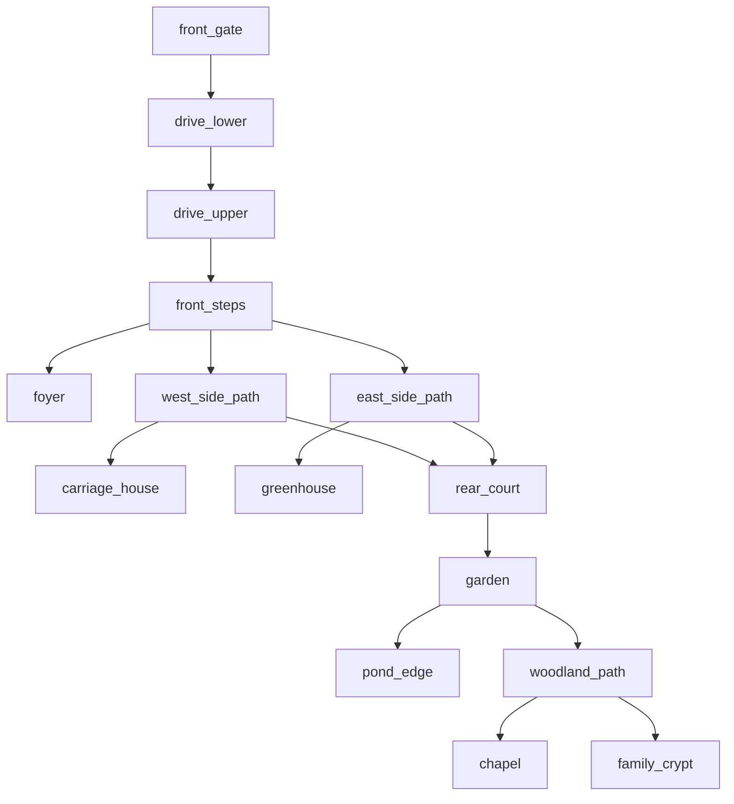

# Grounds World Specification

This document defines the intended shipped topology for the exterior estate.

It exists because the current declaration/runtime still treats too much of the
opening grounds as a single authored room. That is not the game we want.

The exterior should feel like the mansion interior now feels:

- one coherent place
- multiple authored beats
- seamless local traversal
- clear ceremonial, service, and garden-side circulation
- controlled reveals rather than one giant exposed lawn

For the visual thesis of each beat, see `docs/GROUNDS_TABLEAUX.md`.

---

## Core Rule

The grounds are one estate world with staged access.

The player should eventually understand that Ashworth Manor has:

- a formal front approach
- a west/service side
- an east/garden side
- a rear court and rear grounds
- deeper landscape beyond the immediate house footprint

The player should not get all of that immediately.

Front approach first.
Side circulation later.
Rear grounds last.

---

## Canonical Exterior Structure

### 1. Front Approach

The opening sequence is not one room. It is a chain of exterior beats:

- `front_gate`
- `drive_lower`
- `drive_upper`
- `front_steps`

Purpose:

- diegetic main menu at the gate
- hedge-lined ceremonial arrival
- increasing facade presence
- commitment at the front door

Rules:

- the player should not be able to see beyond the estate boundary from the opening lane
- clipped hedges, walling, tree masses, and mansion wings must create occlusion
- the route should feel long enough to sell wealth and trespass

### 2. Side Branches From The Forecourt

At or near `front_steps`, the ceremonial approach splits.

Two side gates or side threshold breaks should exist where the front hedge
terminators meet the side circulation.

West branch:

- `west_side_path`
- servant/service read
- carriage traffic logic
- rougher surface and more practical lighting
- ultimately leads toward `carriage_house`

East branch:

- `east_side_path`
- ornamental/garden read
- more formal edging and controlled planting
- ultimately leads toward `greenhouse`

These branches should hug the house and hedge/wall boundaries. They should feel
like routes around a real mansion, not like paths through an empty game field.

### 3. Rear Grounds

The rear should become a full exterior discovery domain.

Core rear spaces:

- `rear_court`
- `garden`
- `pond_edge`
- `woodland_path`
- `chapel`
- `family_crypt`
- `greenhouse`
- `carriage_house`

The rear should feel larger and less ceremonial than the front, but still
authored and aristocratic.

---

## Canonical Exterior Topology

This is the intended shipped topology.

It says:

- the front path is a sequence, not a stage
- the forecourt is the branching exterior hinge
- both sides can wrap to the back
- the rear is a real place, not a disconnected second map

---

## Progression Staging

### Act I: Arrival

Open:

- `front_gate`
- `drive_lower`
- `drive_upper`
- `front_steps`
- `foyer`

Closed or visually foreshadowed only:

- `west_side_path`
- `east_side_path`
- rear grounds

### Act II: Estate Opens

One or both side routes become accessible depending on pacing needs.

Recommended:

- west/service route unlocks first if the story wants servant knowledge first
- east/garden route unlocks first if the story wants beauty-turned-decay first

### Act III: Full Exterior Understanding

The player can loop around the mansion and understand:

- the relationship between the front and the rear
- the service side and carriage logic
- the garden side and greenhouse logic
- the chapel/crypt as deeper estate geography

---

## Spatial Grammar By Exterior Zone

### Front Approach

Mood:

- ceremonial
- exposed
- moonlit
- controlled

Materials:

- clipped hedges
- gravel or paving run
- gate ironwork
- formal facade lighting

### West / Service Side

Mood:

- practical
- hidden
- narrower
- servant circulation

Materials:

- rough gravel
- wheel-rut logic
- service doors
- more worn hedge or wall edges

### East / Garden Side

Mood:

- ornamental
- cultivated
- refined but eerie

Materials:

- cleaner pathing
- planting beds
- greenhouse sightlines
- more formal edging

### Rear Grounds

Mood:

- secluded
- expansive
- uncanny
- memory-haunted

Materials:

- rear terrace or rear court hardscape
- formal garden remains
- pond edge or stone lip
- woodland boundary

---

## Pond and Woods

The pond and woods are approved additions because they add real estate scale,
occlusion, and emotional range.

### `pond_edge`

Role:

- moon reflection space
- melancholic atmosphere beat
- greenhouse-adjacent lyrical zone
- possible memory/flashback staging area

Possible dressing:

- dead lilies
- reeds
- stone edging
- collapsed jetty or footbridge
- ornamental statuary

### `woodland_path`

Role:

- rear boundary occlusion
- dread corridor
- route toward `chapel` and `family_crypt`
- place for hidden clues or apparition beats

Possible dressing:

- dense winter tree line
- low stone markers
- ruined fencing
- overgrown path breakups

---

## Runtime / Compiler Guidance

### Target Shipped Model

The grounds should ultimately compile as one coherent runtime world:

- `estate_grounds_world`

Authoring regions inside that world may include:

- `entrance_approach_region`
- `west_service_region`
- `east_garden_region`
- `rear_grounds_region`

### Interim Acceptable Model

If runtime constraints require it, the grounds may temporarily remain split into:

- `entrance_path_world`
- `rear_grounds_world`

But the declarations and docs should still be authored toward the final
wraparound topology, not toward two unrelated outside maps.

---

## Planned Room IDs

### Existing IDs To Preserve

- `front_gate`
- `garden`
- `greenhouse`
- `carriage_house`
- `chapel`
- `family_crypt`

### Planned New IDs

- `drive_lower`
- `drive_upper`
- `front_steps`
- `west_side_path`
- `east_side_path`
- `rear_court`
- `pond_edge`
- `woodland_path`

These are the preferred names unless implementation constraints force a
different naming convention.

---

## Asset Direction

Current repo and asset inventory already cover a large part of this.

Confirmed useful PSX asset families from `/Volumes/home/assets/3DPSX`:

- side and front gate candidates:
  - `Environment/Nature/Fences/metal_fence/gate.glb`
  - `Environment/Nature/Fences/metal_fence/metal_fence_gate_with_gate.glb`
  - `Environment/Nature/hedge_maze_pack/misc_models/fences/fence1_single_gate.glb`
  - `Environment/Nature/hedge_maze_pack/misc_models/fences/fence2_single_gate.glb`
  - `Environment/Nature/hedge_maze_pack/misc_models/fences/fence3_single_gate.glb`
- hedge and bush corridor pieces:
  - `Environment/Nature/All bushes/...`
  - `Environment/Nature/hedge_maze_pack/...`
- winter tree lines and wooded boundary dressing:
  - `Environment/Nature/retro_nature_pack/trees/tree##_winter.glb`
  - `Environment/Nature/tree_pack_1.1/tree##.glb`

Current thin spot:

- dedicated pond / jetty / dock meshes are not obviously present in the PSX
  library scan. The current likely implementation is:
  - authored scene prop `res://scenes/shared/water/estate_pond_water.tscn`
    wrapping the local `res://shaders/water/stylized_water_surface.gdshader`
  - stone edging / retaining lip from existing structure kits
  - reeds, winter bushes, statuary, and trees for dressing

Possible future asset asks, only if the current repo and `/Volumes/home/assets/3DPSX`
do not cover the final look well enough:

- pond edge / jetty pieces
- more formal rear statuary or garden edging
- more specialized greenhouse-adjacent ornamental pieces

So the immediate answer is:

- no new gate, hedge, or winter-tree asset request is needed
- pond-specific hero dressing may eventually want a few more PSX assets
